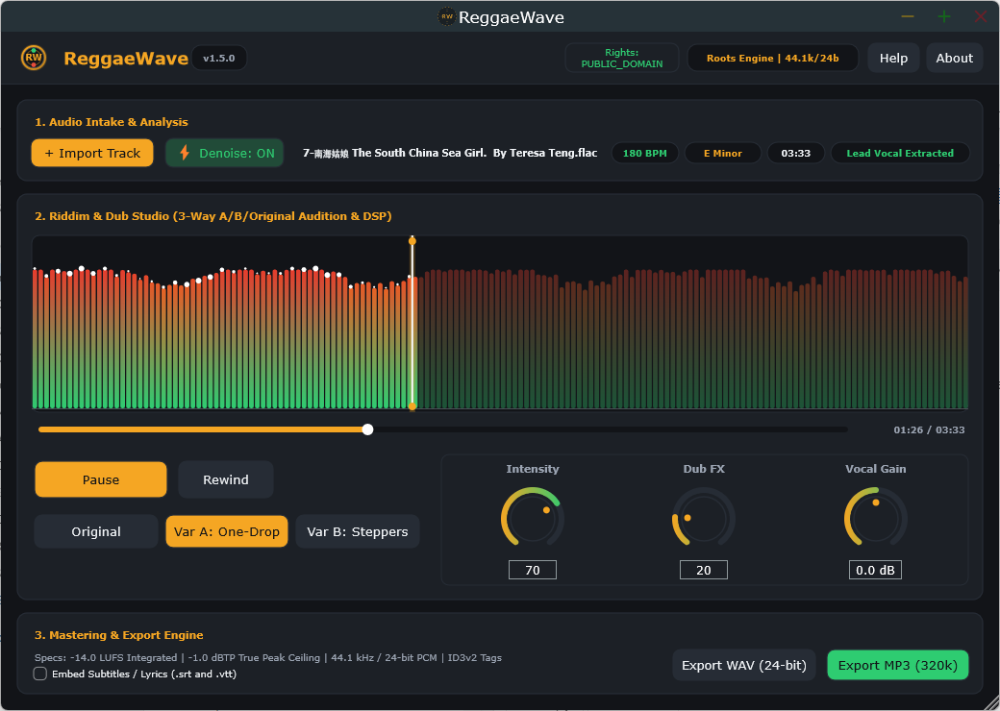

# ReggaeWave

[](https://en.cppreference.com/w/cpp/20)
[](https://juce.com/)
[](#rights-and-licensing)

**ReggaeWave** transforms rights-cleared musical input from any source genre into an authentic, culturally reviewed **Reggae** arrangement. 

Latest full-build tag: `v1.6.8-2608242`.

The output is always **Reggae**—no target-genre selector is needed. ReggaeWave separates stems, preserves the original lead vocal without voice cloning, generates authentic drum, bass, and skank rhythm sections, provides real-time Dub effects, and renders two synchronized variations for comparison and export.



---

## Key Features

- **Any Genre In, Reggae Out**: Feed in Rock, Pop, Classical, Hip-Hop, or Jazz; receive an authentic Reggae arrangement.
- **Vocal Preservation**: The separated lead vocal melody, phrasing, and timbre are preserved intact—no voice cloning, celebrity voices, or synthetic replacements.
- **Three Precision Tuning Controls**:
  1. **Reggae Intensity** (`0–100`, default `70`): Controls bass presence, offbeat skank aggression, and rhythmic substitution.
  2. **Dub-Effects Amount** (`0–100`, default `20`): Real-time tape delay with saturation, spring reverb diffusion, and resonant low-pass filter sweeps.
  3. **Vocal Level** (`-6.0 dB to +6.0 dB`, default `0.0 dB`): Lead vocal gain staging in the final mix.
- **Dual-Variation A/B Comparison**: Generates two synchronized variations (e.g., *Variation A: Classic Roots / One-Drop* vs. *Variation B: Modern Steppers*) with click-free, sample-accurate timestamp crossfading.
- **Master-Ready Exports**: 320 kbps MP3 and 44.1 kHz 24-bit stereo WAV mastered to `-14 LUFS` integrated with a `-1 dBTP` true peak ceiling.
- **Optional Lyric Visualizer**: Optional transcription with user revision support and export to SRT, VTT, and MP4 lyric video.

---

## Rights & Cultural Safeguards

- **Mandatory Rights Attestation**: ReggaeWave processes only user-owned, explicitly licensed, or authorized public-domain material. Attestations can never be bypassed or pre-selected.
- **Jamaican Living Cultural Heritage**: Reggae is recognized by UNESCO as Intangible Cultural Heritage. ReggaeWave avoids caricature and superficial presets, subjecting musical pipelines to review by qualified Reggae practitioners.

---

## Repository Structure

```text
ReggaeWave/
├── apps/
│   └── desktop/                  # JUCE 8 desktop application (GUI & audio host)
│       └── Source/
│           ├── UI/               # Custom dark theme, rotary dials, A/B waveform
│           ├── MainComponent.cpp # Application coordinator & DSP wiring
│           └── MainWindow.cpp    # Window lifecycle & display management
├── packages/
│   ├── contracts/                # Domain types, state machines & tuning bounds
│   ├── audio-engine/             # Real-time Dub DSP, A/B transport & LUFS metering
│   └── storage/                  # Transactional local SQLite state storage
├── docs/
│   ├── PRD.md                    # Product Requirements Document (Source of Truth)
│   ├── note-0005a-android-gradle-packaging-design.md
│   ├── note-0005b-android-gradle-packaging.md
│   └── assets/                   # Documentation images
└── tests/                        # Catch2 unit & DSP integration test suite
```

---

### Cross-Platform Build Instructions

#### 🪟 Windows 11 (PowerShell / Command Prompt)
Prerequisites: Visual Studio 2022 (*Desktop development with C++*) + `winget install Kitware.CMake Git.Git`
```powershell
# 1. Configure Visual Studio 2022 solution
cmake -B build -G "Visual Studio 17 2022" -A x64

# 2. Build Release executable
cmake --build build --config Release --parallel

# (Optional) Run tests
ctest --test-dir build -C Release --output-on-failure
```

#### 🍏 macOS (Terminal)
Prerequisites: Xcode CLI Tools (`xcode-select --install`) + `brew install cmake`
```bash
# 1. Configure Release build
cmake -B build -DCMAKE_BUILD_TYPE=Release

# 2. Build Release app bundle
cmake --build build --config Release --parallel

# (Optional) Run tests
ctest --test-dir build -C Release --output-on-failure
```

#### 🐧 Linux (Terminal)
Prerequisites: `sudo apt update && sudo apt install -y build-essential cmake ninja-build pkg-config libasound2-dev libgtk-3-dev libcurl4-openssl-dev libx11-dev libxrandr-dev libxinerama-dev libxcursor-dev libgl1-mesa-dev libfreetype6-dev`
```bash
# 1. Configure Ninja Release build
cmake -B build -G Ninja -DCMAKE_BUILD_TYPE=Release

# 2. Build Release binary
cmake --build build --config Release --parallel

# (Optional) Run tests
ctest --test-dir build -C Release --output-on-failure
```

---

## Mobile Editions: Current Status and Testing

The shared JUCE mobile source lives in `apps/mobile/`. Android is packaged by the tracked Gradle project at `apps/mobile/Builds/Android/`.

The `libReggaeWaveMobile.so` file seen in older v1.5.0 output is only an internal native Android library. It is not associated with the iOS Simulator and cannot be installed or tested on its own; the installable Android outputs are the APK and AAB produced by Gradle.

- **iOS Simulator ZIP**: A `ReggaeWave.app` bundle built for the iOS Simulator. It is not an iPhone App Store package and requires a Mac with Xcode to run.
- **Android debug APK**: A directly installable debug package containing `arm64-v8a` and `x86_64` native code for physical ARM64 devices and Android Studio emulators.
- **Android release AAB**: An unsigned ARM64 Android App Bundle for later signing and distribution tooling. It is not installed directly with `adb`; use the debug APK for local device testing. Production signing and store submission remain out of scope.

### Testing from Windows

- **Android Studio**: Open `apps/mobile/Builds/Android/` as the project. Install Android SDK Platform 34, Build-Tools 34.0.0, NDK 26.2.11394342 (r26b), and CMake 3.22.1. From the repository root, bootstrap the ignored JUCE checkout once, then build:
  ```powershell
  git clone --depth 1 --branch 8.0.4 https://github.com/juce-framework/JUCE.git apps/mobile/third_party/JUCE
  cd apps/mobile/Builds/Android
  .\gradlew.bat --no-daemon :app:assembleDebug_Debug :app:bundleRelease_Release
  adb install -r app\build\outputs\apk\debug_\debug\app-debug_-debug.apk
  ```
  The emulator should use an x86_64 image; a physical Android phone should normally use ARM64. The same APK can be selected from Android Studio's **Run** configuration. The generated release AAB is unsigned and is not a store-ready upload.
- **Android/WSL**: From WSL, run `REGGAEWAVE_RUN_ANDROID_BUILD=1 bash tests/android/test-gradle-project.sh`; the helper uses the Windows Gradle wrapper when `cmd.exe` is available.
- **iOS**: Windows cannot run the iOS Simulator or deploy an iOS app. Use a Mac with Xcode (local, hosted, or remote) to install the iOS Simulator ZIP; a physical iPhone also requires macOS/Xcode for signing and deployment. The `v1.6.8-2608242` GitHub Actions build validates the iOS Simulator target.

---

## Documentation

- **[Product Requirements Document (PRD)](docs/PRD.md)** — Definitive source of truth for product scope, 3-dial creative controls, and mastering specs.
- **[Cultural Evaluation Rubric](docs/rubric-cultural-evaluation.md)** — Safeguarding authentic Jamaican living heritage across 5 acoustic dimensions.
- **[Desktop & Offline Architecture Design](docs/spec-offline-desktop-architecture-design.md)** — Specification for the offline desktop workstation and DSP pipeline.
- **[ADR 0001: Desktop C++20 & JUCE 8 Architecture](docs/adr-0001-desktop-cpp-juce-architecture.md)** — Architecture decision record.
- **[Note 0001: Implementation Plan](docs/note-0001-implementation-plan.md)** — Technical milestones and module breakdown.
- **[Note 0002: Verification Walkthrough](docs/note-0002-walkthrough.md)** — End-to-end verification walkthrough.
- **[Note 0003: Roadmap & Milestones](docs/note-0003-roadmap-and-milestones.md)** — Milestone delivery status.
- **[Note 0004: Realtime DSP & Studio Architecture](docs/note-0004-desktop-studio-architecture-and-realtime-dsp.md)** — Deep dive into audio thread safety and device management.
- **[Note 0005: Mobile Edition Architecture & Testing Guide](docs/note-0005-mobile-edition-architecture-testing-and-roadmap.md)** — First-time mobile developer guide, testing without store accounts, and Android/iOS architecture.
- **[Note 0005a: Android Gradle Packaging Design](docs/note-0005a-android-gradle-packaging-design.md)** — Android APK/AAB packaging architecture and CI behavior.
- **[Note 0005b: Android Gradle Packaging Plan](docs/note-0005b-android-gradle-packaging.md)** — Implementation and verification plan for the Android Gradle project.
- **[Android Testing on Windows 11](docs/guide-android-testing-windows.md)** — Emulator, physical-device, APK installation, package inspection, and crash-log instructions.
