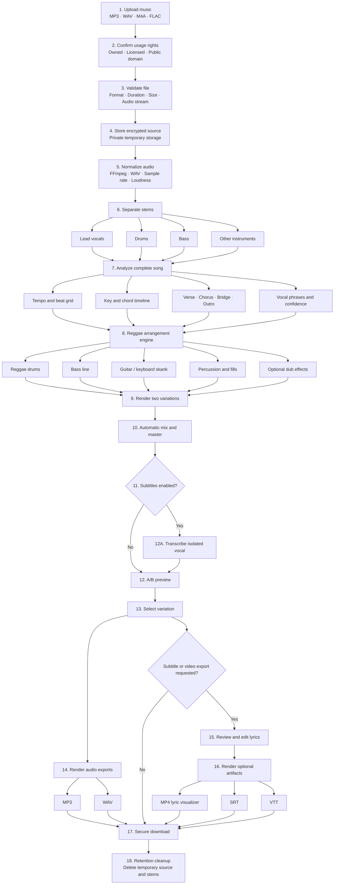

# ReggaeWave Product Requirements Document

| Field | Value |
| --- | --- |
| Product | ReggaeWave |
| Document version | 0.1 |
| Date | 2026-08-18 |
| Status | Approved product design; ready for implementation planning |
| Initial platform | Responsive web application / PWA |
| Input | User-owned, licensed, or public-domain music in any genre |
| Output | Reggae audio, with optional subtitle and lyric-video artifacts |

## 1. Executive summary

ReggaeWave converts a rights-cleared musical recording from any source genre into a Reggae arrangement. The default experience is automatic: the user uploads a song, confirms their rights, starts conversion, compares two generated variations, and exports the preferred result.

The output genre is always **Reggae**. ReggaeWave does not expose a target-genre selector. Users receive only three optional tuning controls:

1. Reggae intensity
2. Dub-effects amount
3. Vocal level

The MVP preserves the separated lead vocal where possible and replaces the original accompaniment with a synchronized Reggae arrangement. The system analyzes tempo, beats, key, chords, sections, and vocal phrases; composes Reggae drums, bass, skank, percussion, and restrained effects; then mixes and masters two variations.

Lyric transcription is optional and disabled by default. When enabled, users can correct the draft lyrics before exporting SRT, VTT, or an MP4 lyric visualizer. Audio exports are MP3 and WAV.

The MVP is feasible as a hybrid, stem-first system. It does not require training a proprietary end-to-end music model. The principal product risk is musical quality across diverse input genres, so a licensed evaluation corpus and human Reggae-producer review are release gates.

## 2. Product context

### 2.1 Problem

Rearranging a finished song into Reggae normally requires musicians, production knowledge, source separation, music transcription, arrangement, mixing, and mastering. Existing AI music tools demonstrate parts of this experience, but users face one or more of these problems:

- The tool generates an unrelated song rather than a recognizable arrangement.
- The workflow requires production expertise.
- Style transformation is restricted to content created inside the vendor's platform.
- Mobile products omit advanced upload and remix features.
- The result is a finished stereo file with little control or explanation.
- Rights restrictions are unclear or handled too late.

### 2.2 Opportunity

ReggaeWave can provide a focused workflow rather than a general-purpose AI music studio: any authorized source genre goes in, and a recognizable Reggae arrangement comes out. A fixed destination genre allows the product to invest in musical quality, cultural review, predictable controls, and a simpler interface.

### 2.3 Cultural context

Reggae originated in Jamaica and is recognized by UNESCO as part of the Intangible Cultural Heritage of Humanity. It is a living musical and cultural practice, not merely an audio effect. Product language, evaluation, presets, and marketing must avoid caricature and must involve Reggae practitioners, including Jamaican expertise, in quality review.

Reference: [UNESCO — Reggae music of Jamaica](https://ich.unesco.org/en/RL/reggae-music-of-jamaica-01398).

## 3. Market research

Research snapshot: 2026-08-18.

| Product | Relevant capability | ReggaeWave takeaway |
| --- | --- | --- |
| Suno | Covers transform a song's style while retaining melody; authorized audio can be uploaded and results can be downloaded as audio or video. | Validate the one-click transformation and A/B-generation experience. Do not depend on a closed consumer workflow. |
| Udio | Paid users can upload, remix, stylize, or extend authorized audio; remix variance can produce genre changes. | Provide a simple strength concept, but constrain it to Reggae rather than exposing arbitrary styles. |
| Moises AI Studio | Separates stems and generates synchronized instrument parts using musical context and genre presets; also provides mixing and mastering. | Strong validation for the recommended stem-first architecture. |
| Fadr | Separates vocals and instruments, detects tempo/key/chords, extracts MIDI, supports remixing, and exports MP3/WAV. | Validate analysis, stem preview, and editable-pipeline patterns. |
| Soundverse | Exposes reference-, melody-, and MIDI-conditioned song generation through an API. | A possible experimental provider, but not the core architecture because of reference limits and vendor dependence. |

Primary sources:

- [Suno Covers](https://help.suno.com/en/articles/2872257)
- [Suno audio uploads](https://help.suno.com/en/articles/6141569)
- [Suno downloads](https://help.suno.com/en/articles/2409921)
- [Udio audio uploads](https://help.udio.com/en/articles/10754328-create-music-with-your-own-audio)
- [Udio remixing](https://help.udio.com/en/articles/10694179-remixing-your-music)
- [Moises AI Studio](https://moises.ai/features/ai-studio-music-creation/)
- [Moises stem-first model description](https://moises.ai/newsroom/product-announcements/launch-ai-studio/)
- [Fadr stem workflow](https://fadr.com/pt/help/stems)
- [Soundverse song-generation API](https://platform.soundverse.ai/docs/song-generation)

### 3.1 Can ReggaeWave mimic these products?

ReggaeWave may independently implement common product patterns such as uploading, job progress, variations, A/B previews, waveform playback, limited sliders, lyric correction, and export. It must not copy product names, branding, proprietary code or models, copyrighted media, or distinctive visual trade dress.

The differentiator is a narrow, culturally reviewed Reggae transformation pipeline—not a clone of a general-purpose music generator.

## 4. Product goals

### 4.1 MVP goals

- Accept an authorized musical recording from any source genre.
- Produce output that qualified listeners recognize as Reggae.
- Preserve the source vocal melody, phrasing, lyrics, and structure when extraction quality allows.
- Make the default conversion require no production knowledge.
- Limit tuning to three understandable controls.
- Generate two variations for comparison.
- Export a complete mix as MP3 or WAV.
- Optionally generate editable lyrics, SRT/VTT subtitles, and an MP4 lyric visualizer.
- Keep all uploaded and generated media private.
- Delete temporary source material and stems automatically.
- Establish replaceable boundaries around external AI providers.

### 4.2 Non-goals for the MVP

- Changing music into genres other than Reggae
- A target-genre or Reggae-subgenre selector
- A digital audio workstation or multitrack timeline editor
- Voice cloning, singer impersonation, or celebrity voices
- Replacing or synthesizing the lead singer
- Training a proprietary end-to-end music-generation model
- Training any model on user uploads
- Public publishing, discovery feeds, likes, follows, or social remixing
- Direct import from streaming services
- Native iOS, Android, Windows, or macOS applications
- Photorealistic or narrative generative video
- Distribution to streaming platforms
- Payments, subscriptions, or commercial licensing automation

## 5. Target users

### 5.1 Primary users

- Independent musicians transforming their own demos or masters
- Producers creating authorized Reggae versions for clients
- Labels and publishers experimenting with music they control
- Content creators using licensed or public-domain music

### 5.2 User need

> When I have the right to use a song, I want to hear and export a credible Reggae arrangement without rebuilding it manually in a studio.

## 6. Product principles

1. **Reggae in one click:** defaults must produce a useful result without tuning.
2. **Fixed destination:** input may be any genre; output is always Reggae.
3. **Musical identity first:** preserve recognizable vocals and structure rather than generating an unrelated track.
4. **Rights before processing:** collect an explicit attestation before accepting a job.
5. **Private by default:** no uploaded or generated media is public.
6. **Human-correctable lyrics:** transcription is a draft, not an unquestionable result.
7. **Culturally reviewed quality:** Reggae practitioners participate in the release decision.
8. **Replaceable AI:** vendor-specific models remain behind internal interfaces.

## 7. Scope and constraints

### 7.1 Supported input

- Musical content from any source genre
- MP3, WAV, M4A, or FLAC
- Maximum duration: 10 minutes
- Maximum file size: 200 MB
- At least one decodable audio stream
- User-owned, explicitly licensed, or public-domain material only

The system does not reject a valid file because of its detected genre. Free-time music, spoken-word recordings, dense live mixes, extreme tempo changes, weak vocal separation, or ambiguous harmony may receive a reduced-confidence warning and lower-quality result.

### 7.2 Rights attestation

Before upload completion, the user must select exactly one basis:

- I own the relevant composition and recording rights.
- I have permission or a license to create this version.
- The material is in the public domain, and this recording is authorized for use.

The user must also accept that they are responsible for the accuracy of the declaration. ReggaeWave stores the attestation type, policy version, user ID, project ID, timestamp, and coarse request-region metadata for audit. ReggaeWave does not claim that an attestation itself grants rights.

Musical arrangements may be derivative works. The product must not suggest that private use, AI processing, or a mechanical license automatically authorizes all transformations. Reference: [U.S. Copyright Office — limitation of claim and derivative works](https://www.copyright.gov/eco/help-limitation.html).

### 7.3 Output

- MP3: 320 kbps stereo
- WAV: 44.1 kHz, 24-bit stereo PCM
- MP4 lyric visualizer when video is enabled: H.264 video with AAC audio, 1080p
- SRT and VTT when subtitles are enabled

## 8. User experience

### 8.1 Primary flow

1. User signs in.
2. User creates a project and selects an audio file.
3. User confirms the applicable rights basis.
4. Client uploads directly to private object storage using a short-lived signed URL.
5. User leaves the three tuning controls at defaults or adjusts them.
6. User leaves subtitles disabled or explicitly enables them.
7. User starts conversion.
8. Processing screen displays stage-level progress and allows cancellation.
9. User receives two synchronized variations and compares them using A/B playback.
10. If subtitles are enabled, the user reviews and edits the generated lyrics.
11. User exports MP3 or WAV and, when enabled, SRT/VTT or an MP4 lyric visualizer.
12. User may delete the project immediately.

### 8.2 Primary screens

#### Upload

- File picker and drag-and-drop target
- Supported format, size, and duration guidance
- Rights-attestation selection
- Three collapsed-by-default tuning controls
- Subtitle toggle, off by default
- Convert action

#### Processing

- Overall state and current processing stage
- Progress indication that does not promise a false completion time
- Safe navigation away from the page
- Cancel action
- Clear failure message and retry action when applicable

#### Compare

- Variation A and Variation B
- Synchronized play/pause and seek
- Immediate A/B switching at the same timestamp
- Waveform overview
- Basic output-quality warning when confidence is reduced
- Select-variation action

#### Export

- MP3 and WAV choices
- Subtitle editor and SRT/VTT choices only when subtitles were enabled
- MP4 lyric-visualizer preview and export only when subtitles were enabled
- Delete-project action

### 8.3 Tuning controls

The controls do not change the destination genre.

| Control | Range | Default | Product meaning |
| --- | --- | --- | --- |
| Reggae intensity | 0–100 | 70 | Controls the prominence of bass, offbeat skank, characteristic drum vocabulary, and arrangement substitution. |
| Dub-effects amount | 0–100 | 20 | Controls send levels and automation for delay, reverb, filtering, and dropouts; it does not select Dub as a separate genre. |
| Vocal level | -6 dB to +6 dB | 0 dB | Adjusts lead-vocal gain in the final mix without changing vocal identity. |

## 9. Functional requirements

### 9.1 Accounts and projects

- **FR-001:** A user must authenticate before creating or processing a project.
- **FR-002:** A user can view only their own projects and assets.
- **FR-003:** A project records source metadata, rights attestation, tuning values, subtitle preference, job state, variations, and exports.
- **FR-004:** A user can permanently delete a project and all associated artifacts.

### 9.2 Intake

- **FR-010:** The client must validate extension, reported MIME type, file size, and required rights fields before requesting an upload URL.
- **FR-011:** The server must inspect the uploaded bytes and audio stream before processing.
- **FR-012:** Invalid, corrupted, encrypted, empty, oversized, or over-duration files must fail before billable processing begins.
- **FR-013:** The original uploaded object must remain immutable until deletion.
- **FR-014:** Direct upload credentials must be scoped to one object, one user, and a short expiration.

### 9.3 Processing

- **FR-020:** Processing must run asynchronously; an HTTP request must not remain open for the duration of conversion.
- **FR-021:** Each pipeline stage must be idempotent, independently observable, and safe to retry.
- **FR-022:** Audio must be normalized to the pipeline's canonical sample rate and channel layout without overwriting the source.
- **FR-023:** The pipeline must separate at least lead vocals, drums, bass, and remaining accompaniment.
- **FR-024:** The pipeline must produce a versioned analysis manifest containing tempo, beat grid, downbeats, key, chord timeline, song sections, vocal activity, duration, and confidence values.
- **FR-025:** The arrangement engine must consume the analysis manifest and tuning values through a provider-independent contract.
- **FR-026:** The engine must generate two Reggae variations with identical duration and aligned start time.
- **FR-027:** The system must preserve the source lead-vocal stem rather than synthesize or clone the singer.
- **FR-028:** The final mix must apply peak protection and target loudness normalization.
- **FR-029:** Users must be able to cancel queued or running jobs. A running atomic stage may finish, but no later stage may start after cancellation is recorded.

### 9.4 Preview and selection

- **FR-030:** A user can stream private previews without downloading the full export.
- **FR-031:** A/B switching must retain the current playback position.
- **FR-032:** The selected variation is recorded explicitly; exporting must never rely on an implicit last-played value.
- **FR-033:** Low-confidence warnings must identify the affected dimension—rhythm, harmony, vocal separation, or structure—without exposing internal stack traces.

### 9.5 Lyrics and video

- **FR-040:** Subtitle generation must be disabled by default on every new project.
- **FR-041:** When enabled, transcription must use the isolated vocal rather than the full mix.
- **FR-042:** The transcript must store word or phrase timing and confidence.
- **FR-043:** Users must be able to edit text and timing before subtitle or video export.
- **FR-044:** The original machine transcript and user-edited revision must be distinguishable in audit metadata.
- **FR-045:** The MP4 MVP is a template-based lyric visualizer using approved artwork, waveform/level animation, track title, and timed lyrics. It is not generative narrative video.

### 9.6 Export and retention

- **FR-050:** Audio export must support MP3 and WAV.
- **FR-051:** Subtitle export must support SRT and VTT when enabled.
- **FR-052:** Video export must support MP4 when subtitles are enabled and the transcript passes validation.
- **FR-053:** Downloads must use user-scoped, short-lived signed URLs.
- **FR-054:** Temporary source files, separated stems, canonical intermediates, and analysis-only audio must be deleted within 24 hours after a job reaches a terminal state.
- **FR-055:** Final exports and project metadata must expire 30 days after completion unless the user deletes them earlier.
- **FR-056:** Project deletion must revoke active download access immediately and enqueue physical object deletion.

## 10. Processing architecture

### 10.1 Logical components

- **Web client:** Responsive TypeScript PWA for intake, tuning, status, A/B playback, lyric editing, and export.
- **Application API:** Python API for identity, authorization, projects, rights attestations, signed URLs, quotas, and job commands.
- **Workflow workers:** Durable asynchronous processing with stage-level retry and cancellation checks.
- **Audio processing:** FFmpeg plus Python music and DSP tooling.
- **Separation/analysis adapters:** Internal interfaces around the production provider and local development fallback.
- **Arrangement engine:** Internal, versioned engine that maps the analysis manifest and three tuning values to renderable Reggae stems.
- **Mix/master engine:** Deterministic DSP chain with versioned settings and measured output validation.
- **Transcript/video renderer:** Isolated-vocal transcription, revision storage, subtitle generation, and FFmpeg-based visualizer rendering.
- **Persistence:** PostgreSQL for metadata, Redis-backed jobs, and S3-compatible private object storage.

### 10.2 Initial implementation stack

- Web: TypeScript, React, Next.js, and PWA support
- API/workers: Python, FastAPI, Celery, and Redis
- Metadata: PostgreSQL
- Media: private S3-compatible object storage and FFmpeg
- Identity: managed OIDC using email magic-link authentication; ReggaeWave does not store passwords
- Production separation and music analysis: Music AI API behind a ReggaeWave adapter
- Local development separation fallback: Demucs, whose upstream project is MIT-licensed but not actively feature-maintained
- Production lyrics: isolated-vocal transcription through a Music AI workflow behind a ReggaeWave adapter
- Local development transcription fallback: Whisper-compatible adapter using only approved test media
- Rendering: versioned internal arrangement, DSP, and video-render contracts
- Deployment: containerized services with CPU and GPU worker pools separated by queue

References:

- [Music AI API](https://music.ai/docs/api/reference/)
- [Demucs](https://github.com/facebookresearch/demucs)
- [Whisper](https://github.com/openai/whisper)
- [MusicGen melody conditioning research](https://audiocraft.metademolab.com/musicgen.html)

MusicGen is a research reference, not an approved production dependency. Any model introduced later must pass license, training-data, quality, security, and cost review.

### 10.3 Key data entities

- **User:** identity and account state
- **Project:** owner, title, state, tuning, subtitle preference, and retention dates
- **RightsAttestation:** selected basis, policy version, timestamp, and audit fields
- **SourceAsset:** immutable source metadata and private object reference
- **ProcessingJob:** project, current state, pipeline version, cancellation state, and timestamps
- **StageRun:** idempotency key, attempt, provider, status, metrics, and sanitized failure category
- **AnalysisManifest:** versioned musical analysis and confidence values
- **Variation:** arrangement version, seed, preview, quality measurements, and selection state
- **TranscriptRevision:** machine output, user revision, timing, and revision metadata
- **ExportAsset:** format, codec properties, checksum, expiry, and object reference
- **AuditEvent:** security- and rights-relevant actions without audio content

## 11. Job states and failure behavior

### 11.1 Job states

The conversion job uses:

`created → uploading → validating → queued → normalizing → separating → analyzing → arranging → mixing → transcribing → preview_ready → completed`

Subtitle-disabled conversion jobs skip `transcribing`. `completed` means that both audio previews—and the machine transcript when requested—are ready for user review. Terminal alternatives are `failed`, `cancelled`, `expired`, and `deleted`.

Each user-triggered export is a separate job using:

`created → queued → rendering → validating → completed`

Export-job terminal alternatives are `failed`, `cancelled`, `expired`, and `deleted`. MP3/WAV export is independent of subtitle state. SRT, VTT, and MP4 jobs require subtitles to have been enabled and a valid transcript revision to exist.

Conversion jobs left at a reviewable state and their projects expire 30 days after conversion completion. Expiry revokes access and starts the same deletion workflow as explicit project deletion.

### 11.2 Failure rules

- Validation failures are final until the user changes the input.
- Transient provider, network, or worker failures retry with bounded exponential backoff.
- Deterministic media failures do not retry indefinitely.
- A retry resumes from the earliest missing or invalid stage artifact.
- Successful stage results are addressed by pipeline version and idempotency key.
- Provider errors are mapped to stable product error categories.
- Stack traces, object-storage keys, API secrets, and signed URLs never appear in user-visible errors or analytics.
- A failed subtitle stage must not invalidate successful MP3/WAV outputs; the user may retry subtitles separately.
- A failed MP4 render must not invalidate SRT/VTT or audio exports.
- Reduced-confidence musical analysis generates a warning and continues.

## 12. Privacy, security, and responsible use

- Encrypt network traffic and stored media using managed platform controls.
- Keep object storage private; do not expose stable public media URLs.
- Enforce tenant ownership on every project, job, preview, transcript, and export lookup.
- Store provider credentials only in server-side secret management.
- Never place provider secrets in web or mobile clients.
- Send user audio to only approved subprocessors named in the privacy policy.
- Do not use uploaded or generated media for model training, evaluation, marketing, or human review without separate explicit opt-in.
- Strip unnecessary embedded metadata from generated exports.
- Apply upload rate limits, content-length limits, MIME sniffing, decode isolation, and decompression limits.
- Record rights and deletion events in an append-only audit trail.
- Make account and project deletion accessible without contacting support.
- Document retention separately for temporary media, final exports, operational logs, and legal/audit records.

## 13. Non-functional requirements

### 13.1 Reliability

- At least 95% of valid, in-scope jobs in the release corpus reach `preview_ready` without manual intervention.
- A worker restart must not duplicate user-visible variations or corrupt job state.
- Job state must remain recoverable after browser closure or API restart.
- Export checksums and codec probes must pass before a download is offered.

### 13.2 Performance

- Upload uses direct object-storage transfer and shows byte progress.
- Validation begins within 10 seconds after upload completion under normal load.
- For a five-minute track, 95% of successful MVP jobs reach preview within 15 minutes under the documented reference deployment.
- A/B preview switching begins within 250 ms after both preview buffers are ready on a typical broadband connection.

### 13.3 Accessibility and compatibility

- Meet WCAG 2.2 AA for the primary flow.
- All controls, playback, A/B switching, lyric editing, and export are keyboard operable.
- Progress and errors are announced to assistive technologies without excessive repetition.
- Support the latest two stable versions of Chrome, Safari, Firefox, and Edge at release.
- Support responsive widths from 320 px upward.

### 13.4 Observability

- Emit structured events for each state transition and stage attempt.
- Measure stage duration, queue delay, provider latency, retry count, failure category, artifact size, and compute cost.
- Correlate logs using non-secret project, job, and stage identifiers.
- Do not log lyrics, audio content, signed URLs, credentials, or rights evidence contents.

## 14. Quality and acceptance criteria

### 14.1 Licensed evaluation corpus

Before public MVP release, maintain an evaluation corpus of at least 50 authorized tracks spanning pop, rock, hip-hop, R&B, electronic, jazz, folk/acoustic, classical/cinematic, Latin, and other representative source material. Store a machine-readable license manifest beside the test catalog. Do not commit evaluation audio to the normal Git repository.

### 14.2 Musical review

Use a panel of at least three experienced Reggae practitioners, including at least one Jamaican practitioner. Reviewers score blind A/B outputs on a five-point rubric:

- Recognizable Reggae rhythm and feel
- Bass/drum relationship
- Offbeat skank placement
- Harmony and section coherence
- Vocal preservation and synchronization
- Mix usability and absence of distracting artifacts

Release thresholds:

- At least 80% of corpus outputs receive a median Reggae-recognition score of 4/5 or better.
- At least 75% receive a median overall-usability score of 3/5 or better.
- No systematic failure is present for a named source genre in the evaluation corpus.

### 14.3 Automated audio checks

- Output duration matches the analysis manifest within 100 ms.
- No output sample exceeds the configured true-peak ceiling of -1 dBTP.
- Default final mixes target -14 LUFS integrated, with documented tolerance of ±1 LU.
- Required audio streams decode from beginning to end.
- Both variations use the same start time and duration for A/B playback.
- Exported WAV is 44.1 kHz, 24-bit stereo PCM.
- Exported MP3 is 320 kbps stereo.
- SRT and VTT cues are ordered, non-negative, non-overlapping after normalization, and within media duration.
- MP4 contains decodable H.264 video and AAC audio and remains synchronized through the final frame.

### 14.4 Product acceptance

- Rights attestation is impossible to bypass through the supported client or API.
- Subtitle generation is off for every new project unless explicitly enabled.
- Exactly three creative controls are visible in the MVP conversion flow.
- No target-genre selector exists.
- Cancellation prevents subsequent stages from starting.
- Failed subtitle/video processing leaves successful audio available.
- Deletion immediately revokes access and completes physical deletion within the retention requirement.
- Cross-user authorization tests cannot access another user's metadata or media.

## 15. Testing strategy

- **Unit tests:** rights rules, tuning bounds, state transitions, idempotency keys, retention dates, analysis-schema validation, arrangement rules, subtitle normalization, and export profiles.
- **Contract tests:** web/API schemas, worker messages, provider adapters, analysis manifests, and artifact metadata.
- **Integration tests:** signed upload, validation, queueing, stage retry, cancellation, deletion, provider failure mapping, and export probing.
- **Golden audio tests:** short owned or CC0 fixtures with measurable beat, chord, duration, loudness, and synchronization assertions.
- **Human listening tests:** the licensed multi-genre corpus and Reggae-practitioner rubric.
- **End-to-end tests:** upload through preview and export, with subtitles both disabled and enabled.
- **Security tests:** tenant isolation, expired URLs, malformed media, rate limits, secret redaction, and deletion.
- **Accessibility tests:** automated checks plus keyboard and screen-reader review of the primary flow.

Tests and fixtures must never use an unlicensed commercial recording.

## 16. Analytics and success measures

### 16.1 North-star metric

Number of rights-cleared projects that produce a user-selected Reggae export.

### 16.2 MVP funnel

- Project created
- Rights attested
- Upload validated
- Preview ready
- Variation selected
- Export completed

### 16.3 Initial success targets

- At least 70% of validated uploads reach a successful preview.
- At least 40% of projects that reach preview export one variation.
- At least 60% of users who export rate the result as recognizably Reggae.
- Fewer than 5% of successful audio jobs require support intervention.
- Zero known cross-user media disclosures.

Analytics must not contain audio, lyrics, signed URLs, or filenames supplied by users.

## 17. Delivery strategy

### 17.1 Feasibility gate

Build a throwaway offline pipeline against ten authorized tracks from at least five source genres. It must prove:

- useful vocal separation,
- stable beat/chord/section manifests,
- aligned Reggae drums, bass, and skank,
- two materially different but coherent variations,
- deterministic WAV rendering, and
- blind recognition as Reggae by the review panel.

Proceed to product implementation only if at least eight of ten tracks are recognized as Reggae and at least six are judged usable after no more than one automated rerender.

### 17.2 MVP implementation

After the feasibility gate passes, implement the responsive web workflow, durable processing, privacy controls, two-variation preview, export, optional subtitle editing, and lyric visualizer.

### 17.3 Post-MVP opportunities

- Native mobile clients sharing the same API contracts
- Desktop packaging for local project management
- Higher-quality proprietary or licensed stem-generation models
- Optional user-controlled stem export
- Additional Reggae arrangement vocabulary without exposing genre switching
- User-provided artwork templates
- Rights-holder and label administration

Each post-MVP item requires its own approved product and rights review.

## 18. Principal risks and mitigations

| Risk | Impact | Mitigation |
| --- | --- | --- |
| Poor separation contaminates the vocal | Unusable mix | Confidence scoring, provider abstraction, warning, and corpus benchmarking |
| Harmony or beat detection is wrong | New instruments clash | Cross-check analysis signals, bounded correction heuristics, and reduced-confidence handling |
| Output sounds like generic pop with effects | Product fails its promise | Fixed Reggae vocabulary, specialist listening panel, and explicit recognition gate |
| Input diversity produces inconsistent results | Low trust | Multi-genre licensed corpus and no genre-based rejection claims |
| Sung-lyric transcription is inaccurate | Bad subtitles | Disabled by default, confidence display, mandatory editable draft before MP4 |
| Users upload unauthorized music | Legal and partner risk | Rights attestation, clear terms, audit trail, private workflow, and takedown process |
| Vendor changes pricing or behavior | Cost or outage | Internal adapters, stored provider/version metadata, and local fallback paths |
| Processing is slow or expensive | Poor conversion economics | Stage metrics, caching by immutable input/version, separated worker pools, and cost budgets |
| Reggae is treated superficially | Cultural and quality harm | Jamaican/Reggae practitioner involvement and language/style review |
| Temporary media persists | Privacy breach | Lifecycle rules, deletion queues, reconciliation jobs, and retention monitoring |

## 19. Locked product decisions

- Product name: **ReggaeWave**
- Correct genre spelling in product copy: **Reggae**
- Input genre: any musical genre
- Rights scope: user-owned, licensed, or public-domain material only
- Output genre: Reggae only
- Tunability: Reggae intensity, dub-effects amount, and vocal level only
- Variations: two per conversion
- Lyrics/subtitles: optional and disabled by default
- Initial client: responsive web/PWA
- Audio exports: MP3 and WAV
- Subtitle exports: SRT and VTT when enabled
- Video export: template-based MP4 lyric visualizer when subtitles are enabled
- Generation architecture: hybrid, stem-first
- Lead vocal behavior: preserve; do not clone or replace
- Model training on user uploads: prohibited
- Temporary-media retention: delete within 24 hours of terminal job state
- Final-export retention: 30 days
